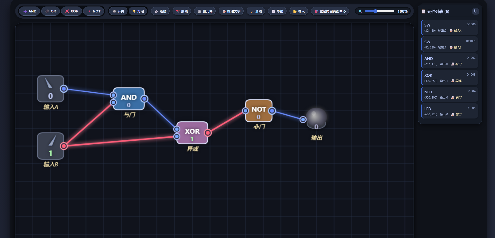

# 🧠 交互式逻辑门电路模拟器

一个基于 Web 的交互式数字逻辑电路模拟器。无需安装，直接在浏览器中通过拖放逻辑门、开关和灯泡来构建和模拟数字电路，并观察实时信号流。

**在线体验**: [./index.html]

## ✨ 特性

*   **直观的可视化构建**
    *   拖放式放置逻辑门（AND, OR, XOR, NOT）、开关和LED灯泡。
    *   可视化连线，连接元件端口。
    *   实时高亮显示信号状态（高电平红色/低电平蓝色）。

*   **完整的交互功能**
    *   **多种操作模式**：拖拽移动、连线、删除元件/连线、添加文字批注。
    *   **视图控制**：支持画布平移与平滑缩放。
    *   **元件管理**：侧边栏列出所有元件及其状态（ID、坐标、输出值、标签），点击可快速定位。
    *   **开关控制**：点击开关“拨杆”即可切换0/1输入状态。

*   **电路持久化**
    *   **导出**：将当前电路保存为JSON文件。
    *   **导入**：从JSON文件加载之前保存的电路。

*   **即开即用与跨平台**
    *   纯前端实现，单HTML文件包含所有资源，无需后端。
    *   响应式设计，完美支持桌面和移动设备（支持触摸手势、双指缩放）。
    *   内置演示电路，打开即玩。

## 🚀 快速开始

1.  **直接运行**：
    *   双击打开 `index.html` 文件，或将其拖入浏览器窗口。
    *   页面加载后即可看到内置的演示电路。

2.  **基本操作**：
    *   **添加元件**：点击顶部工具栏的按钮（如 `➕ AND`， `🔘 开关`）。
    *   **移动元件**：在默认“拖拽/移动”模式下，点击并拖动元件主体。
    *   **连接线路**：点击 **`🔗 连线`** 按钮，先点击一个元件的**输出端口**（右侧圆点），再点击目标元件的**输入端口**（左侧圆点）。
    *   **切换开关**：点击开关上的“拨杆”部分。
    *   **平移视图**：在画布空白处拖拽，或使用鼠标中键/右键拖拽。
    *   **缩放视图**：使用顶部的滑块，或使用触摸板双指缩放、鼠标滚轮。

## 📁 项目结构
Logic-Gate-Simulator
 |index.html